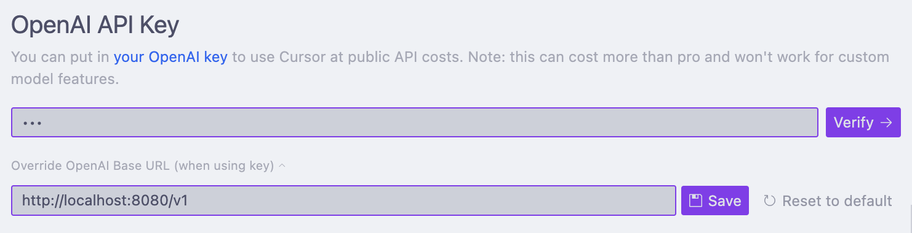

# 02u6: Ollama OpenAI API Proxy

This is a simple proxy server that translates OpenAI API requests to Ollama API requests, allowing you to use Ollama models with tools that expect OpenAI's API format.

Wrote this to use local models with [cursor.ai](https://www.cursor.com/).

## Prerequisites

- Go 1.21 or later
- Running Ollama instance (default: <http://localhost:11434>)

## Installation

```bash
git clone https://github.com/t3nsed/02u6
cd 02u6
go build
```

## Usage

Start the proxy server:

```bash
./ollama-openai-proxy
```

The server will start on port 8080 by default.

Use the proxy with OpenAI-compatible clients by setting the base URL to `http://localhost:8080`

Example curl request:

```bash
curl http://localhost:8080/v1/chat/completions \
  -H "Content-Type: application/json" \
  -d '{
    "model": "llama2",
    "messages": [
      {
        "role": "user",
        "content": "Hello, how are you?"
      }
    ]
  }'
```

## Cursor Integration

Set it up like in the screenshot below, API key can be anything, should just not be empty.



After that, deselect **all** models and create a new model with exactly the same name as the model you use in ollama. So if you run `ollama run deepseek-r1:1.5b` then create a new model with name `deepseek-r1:1.5b`. Just to let you know, because I tried it for like 30mins with just `deepseek-r1` and it didn't work (felt a bit dumb). Neither my proxy nor cursor will give you any help on why some config stuff is wrong.

I'm sure you can figure it out :)

## Configuration

The following constants can be modified in `main.go`:

- `OLLAMA_API_BASE`: The base URL of your Ollama instance (default: <http://localhost:11434>)
- `LISTEN_ADDR`: The address and port the proxy server listens on (default: :8080)
